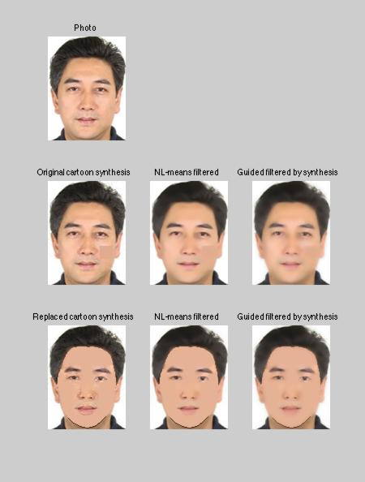
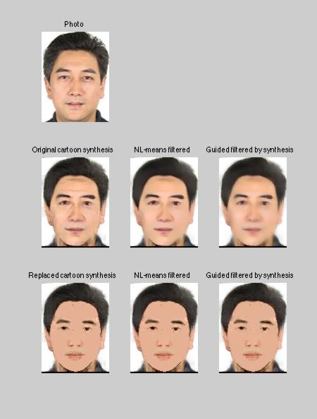
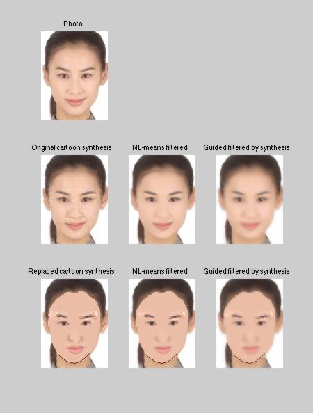
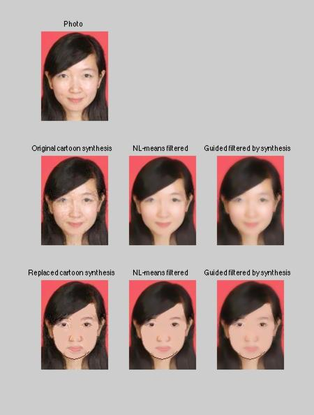
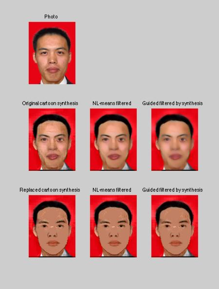
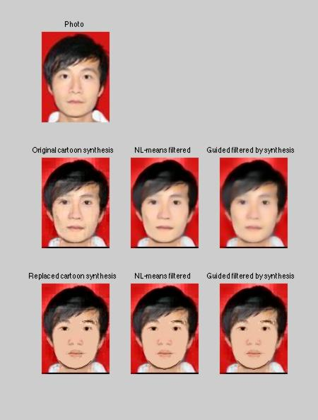
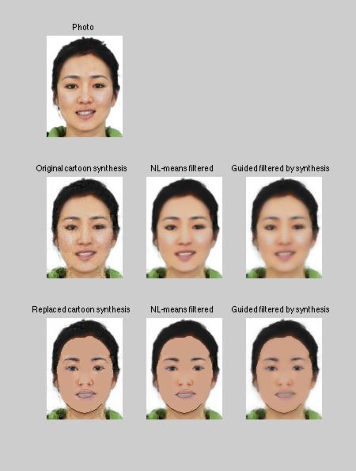
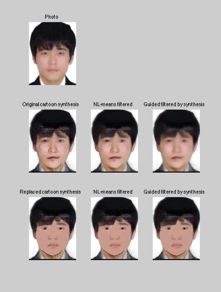
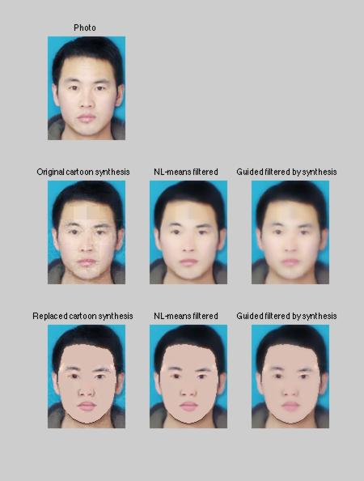
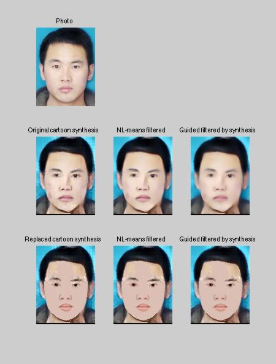

## CartoonFaceSynthesize

Given a face photo as input, synthesize a cartoon face.
* Version1: Implementation of 《Guided Face Cartoon Synthesis》
* Version2: First, using lasso or weight funtion to synthesize and combine all patches to get a global synthesis. Second, synthesize nose, mouth, eyes, brows and seamless clone them into the global synthesis to get detailed synthesis. Finally, remove defects by post-processing.  

### Running

1. Prerequisites
    * MATLAB_R2014a
    * [FLANN](http://www.cs.ubc.ca/research/flann/)
    * [SPAMS](http://spams-devel.gforge.inria.fr/)
    * [Face Detection](https://www.ics.uci.edu/~xzhu/face/)
    * [Guided Image Filtering](http://research.microsoft.com/en-us/um/people/kahe/eccv10/)
    * NL-means
    * PHOG
    * Poisson Image Editing
2. Run version1
    1. run demo1_prepare.m
    2. run demo1.m
3. Run version2
    1. run landmark_prepare.m, brow_prepare.m, eye_prepare.m, mouth_prepare.m, nose_prepare.m, demo2_prepare.m    
    2. run demo2.m

### Exmaples

| **Vesion2-LASSO**                                     | **Version2-Weight Funtion**                                 |
| :-:                                                   | :-:                                                         |     
|     | |
|     | |
|     | |
|     | |
|     | |
|     | |
|     | |
|     | |
